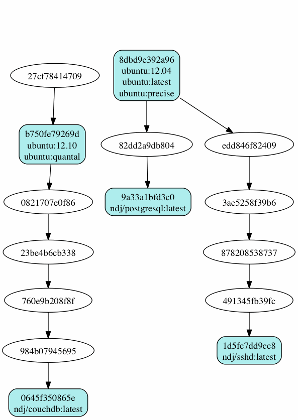

# Docker
## virtual machines reimagined
<br/>
<br/>
#### **Stig Kleppe-Jørgensen**
FINN reise

Note:
Hei, jeg heter Stig, jobber i FINN reise og tenkte jeg skulle gi dere en liten
introduksjon til Docker. Nå har jeg bare holdt på med Docker noen uker, så dere får
være snille og ikke stille for vanskelige spørsmål :-)

----

<!-- .slide: data-background="img/docker-matrix.jpg" data-background-size="100%" -->

Note:
Og hvorfor trenger vi Docker?

Vår verden blir mer og mer komplisert med mange og små applikasjoner/tjenester laget
på forskjellige teknologistakker som skal kjøre på alle slags type maskiner: laptop,
server, fysisk, cloud, osv. Dette skaper hodeverk både for utviklere og driftere.

Docker ble først og fremst utviklet for å gjøre dette til et mindre problem ved at
utvikleren skal kunne putte de teknologiene han vil inn i et image uten å bry seg
om hvor dette skal kjøre, mens drifteren kan kjøre imaget uten å bry seg om hva
som ligger inne i det.

Jeg vil derimot fokusere på andre måter å bruker Docker på i denne presentasjonen.

Først tenkte jeg jeg skulle gå raskt igjennom hva Docker er.

----

## What is Docker?

Lightweight virtual machines + magic sauce

Note:
Litt overfladisk så er Docker lettvekts virtuelle maskiner + litt magi.
Men, for å gå litt dypere...

----

## What is Docker?

* An open source engine
* Automates deployment of any application
* Has lightweight, portable, self-sufficient containers
* Can run virtually anywhere (Linux) with no changes

Note:
Docker er et system for å automatisere deployment av enhver applikasjon.
Disse applikasjonene kjører inne i en container med alle tilhørende dependencies,
fra kjørbare filer til Java VM til biblioteker.
Disse containerne kan kjøre, uten endringer, hvor som helst, fra utviklers laptop,
til å skaleres opp til produksjon, på VMs, bare metal, OpenStack, osv.

----

## Containers

* Containers are not a new technology
  * Linux' LXC, BSD's jails, Solaris' zones, etc
  * Does isolation on process, memory, network, cpu and filesystem
* Containers are a lot faster than VMs, sub second vs 10s of seconds
* No hypervisor, no instruction translation

Note:
Containere kan en si er runtimen til Docker.
Dette er ingen ny teknologi; det finnes implementasjoner av dette i mange OSer.
Containere gir like god isolasjon på tvers av prosess, minne, nettverk, cpu
og filsystem som en VM, men med mye mindre overhead. Dermed er de også mye kjappere.

----

<!-- .slide: data-background="img/containers-vs-vms.png" data-background-size="100%" -->

Note:
Et bilde skal jo være verdt 1000 ord, men det er vel endra bedre å vise.
Bare litt info om miljøet jeg kjører Docker i først. Docker kan pr nå bare kjøre på Linux,
dvs. at jeg på Mac-en må kjøre Docker på en Linux inne i en VM.

----

<!-- .slide: data-background="img/docker-on-osx.png" data-background-size="100%" -->

Note:
Jeg bruker Vagrant for å kjøre opp VM-en som vist på bildet. Nå passer ikke bildet helt
for det er ikke disse kommandoene jeg bruker.

Denne kommer jeg inn i VM-en med:
 vagrant ssh
Docker er client/server som bl.a. snakker over HTTP slik at jeg kan kjøre Docker-klienten
lokalt på Mac-en. Her kjører jeg inne i VM-en for å gi et mer riktig bilde av ytelsen.
 docker run --rm ubuntu env
 time docker run --rm ubuntu env
 time env

----

## Docker images

* A packaging of everything that is needed to run an application
* Built on top of a layered filesystem (AUFS)
* A new layer (version) is made for each change that is committed
* Each version gets an id, a hash

Note:
En annen sak som gjør Docker enda raskere enn VMer å jobbe med, er en slags versjonering av
imagene som applikasjonen er pakket inn i. Dvs. endringer som gjøres på et image kan
committes, noe som gir et helt nytt image, men som bygger på det andre. Akkurat som commit
i git.

----



Note:
Her er et eksempel på en image graf som viser hvordan nye imager bygger på gamle

----

## Docker images

* Can be shared through push/pull
  * A public registry (http://index.docker.io)
* Nice to know: a running instance of a Docker image is called a Docker container

Note:
Når en skal dele dette endrede imaget med andre, vil en push bare sende
endringene som motparten ikke har. Igjen slik git gjør det.

index.docker.io er default for pushing/pulling og her ligger det masse morsomt
klart til å testes ut: databaser, Atlassian-verktøyene, npm registry proxy, kafka,
zipkin, osv. Mange open source verktøy har nå fått et Docker image, slik at en slipper
å installere disse på maskinen hvis en bare skal teste ut ting.

Det er greit å vite at et kjørende Docker image kalles en Docker container.

----

<!-- .slide: data-background="img/docker-changes.png" data-background-size="100%" -->

Note:
På dette bildet ser vi flyten.

Først fjerner jeg siste versjon av ubuntu:
 docker images
 docker rmi -f 99ec81b80c55
 docker images
Så henter jeg den ned igjen; en ser at de fleste allerede er lastet ned
 docker pull ubuntu
 docker images
Nå skal vi gjøre noe som ingen bør prøve på en ordentlig maskin
 docker run -t -i ubuntu bash
 rm -r /bin /sbin /lib /var /usr
 ls
 docker run --rm -t -i ubuntu bash
Hvis vi nå starter imaget på nytt er endringene borte; hvor er det blitt av?
Når vi starter en ny container blir det startet fra samme imaget uten endringene.
Men vi kan committe endringene slik at vi får et nytt image
 docker ps -a
 docker commit eed87e6c9049 damaged
 docker run -t -i damaged bash
Og så kan vi pushe litt
 docker push stigkj/jdk-oracle:7

----

## Dockerfile

* A light weight build definition
* Builds on top of other build definitions
* Not mandatory, can use API
  * Packer (packer.io) does this

Note:
Da kommer vi over på siste bit av hva Docker består av. Dockerfile er en
lettvekts byggdefinisjon. Den må ikke brukes; det er også mulig å bygge
opp et image gjennom APIet, som f.eks. Packer gjør.

----

```
FROM finn/jdk-oracle:7

RUN apt-get -y install tomcat7 && rm -rf /var/lib/tomcat7/webapps/ROOT

RUN mkdir -p /var/lib/tomcat7/temp

RUN mkdir -p /etc/service/tomcat
ADD tomcat.sh /etc/service/tomcat/run
RUN chmod +x /etc/service/tomcat/run

ENV log.dir /var/log/finn

EXPOSE 8080 5005

ENTRYPOINT ["/sbin/my_init"]
```

Note:
Lettvekts byggdefinisjon som kan kjøre vanlige kommandoer, legge til
filer fra host-maskin, sette opp hvilke porter som skal eksponeres,
hvilket program som skal startes opp, og mer.

----

# Demo time

Note:
Det er mye vi morsomt vi kunne kjørt demo på, f.eks. å kjøre CI-bygg inne
i en Docker-container for å slippe kræsj på portnr, etc. I dag tenkte jeg
vi kunne prøve oss på en enkel heroku klone som kalles dokku.

dokku > cp -R tests/apps/nodejs-express /tmp/
cd /tmp/nodejs-express
git init
git add .
git commit -m "First commit"
git add remote dokku dokku:nodejs
git push dokku master
open http://nodejs.dokku.me:8080
> endre 'Dokku' til 'Dokku on Docker'
git commit --all -m "Minor change"
git push dokku master
open http://nodejs.dokku.me:8080

Og til slutt skal vi kjøre opp flysøket i Docker med fig, et Docker-overbygg
som gir en bedre mulighet for å starte opp containere som hører sammen.

flight > fig
fig up -d
fig ps
open http://localdocker:49160/reise/flybilletter
fig scale web=2

Noe annet som kan nevnes med flysøket er at en bruker en slags service discovery
basert på DNS for å finne hvor de ulike tjenestene ligger.

----

# Questions

Note:
De som er interessert i flere demoer kan ta kontakt med meg etterpå.

